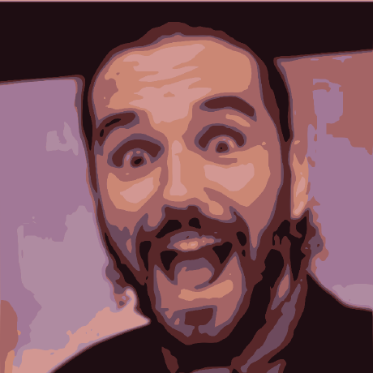

# Samuel Galvão Elias {.cv-name}

Curriculum Vitae

<a href="mailto:sgelias@outlook.com">sgelias@outlook.com</a>
<a href="https://orcid.org/0000-0001-9138-8845">0000-0001-9138-8845</a>
<a href="https://www.linkedin.com/in/sgelias/">sgelias</a>
<a href="https://github.com/LepistaBioinformatics">LepistaBioinformatics</a>
<a href="https://github.com/sgelias">sgelias</a>
<a href="https://lepista.com.br">lepista.com.br</a>&nbsp;/&nbsp;<a href="https://lepista.io">lepista.io</a>
<strong>sgelias</strong>
<a href="https://t.me/sgelias"><strong>@sgelias</strong></a>

## Summaries

### In Microbiology

With approximately twelve years of experience in Microbiology and Mycology, I have developed expertise across two major areas: [Health Sciences](publications.md#health-sciences) (where my career began) and [Life Sciences](publications.md#life-sciences) (the area of greatest depth and current focus). My trajectory in Mycology spans eight years of continuous research conducted in collaboration with leading Brazilian scientists, including Aristóteles Góes-Neto [1], Elisandro Ricardo Drechsler-Santos [2], João Paulo Machado de Araújo [3], José Carmine Dianese [4], Maria Alice Neves [5] and Robert W. Barreto [6] — all mycologists of national and international distinction. Throughout this period, I also established research partnerships with international scientists, among them Charles W. Barnes [7], Mary Catherine Aime [8], Harry C. Evans [9] and Dominik Begerow [10], all of whom I regard as direct and indirect mentors in the field. My primary areas of scientific interest encompass the genetics, taxonomy, ecology and evolution of microorganisms, with emphasis on wild fungi and bacteria lacking commercial relevance, as well as pathogens of agricultural and environmental concern.

Complementing this background, I hold in-depth knowledge of biostatistical and bioinformatic analytical techniques (see section [Bioinformatics](#bioinformatics)), with a particular focus on genomic and metagenomic data analysis.

Driven by scientific inquiry and the elucidation of natural phenomena, a comprehensive account of my scientific contributions is available in the [Publications](publications.md) section.

### And in Bioinformatics {#bioinformatics}

A self-taught bioinformatician with over ten years of experience in biological data analysis through biostatistics and bioinformatics methodologies. In recent years, professional focus has shifted towards the design and development of high-performance and high-availability bioinformatics tools tailored for modern, highly connected web environments.

Currently, core activities encompass the modeling, architecture, development and coordination of multidisciplinary technology teams dedicated to building high-performance biological data processing environments. Areas of technical expertise include solutions for parallel processing — a fundamental requirement for bioinformatics analyses at industrial scale — concurrent processing for distributed computing environments, and the automation of large-scale pipelines.

Additional contributions include the development of web-native and public domain tools (see section [Public Tools](public-software.md)), among them Mycelium API Gateway and Mycelium WebApp, a pair of solutions focused on distributed access control for complex API environments; Blutils CLI and Blutils UI, a pair of tools dedicated to biological sequence analysis; and Classeq, a biological sequence classifier for post-phylogenetic placement. All aforementioned tools are made freely available as open-source projects, accessible and auditable through the official GitHub of the Lepista Bioinformatics organisation.

**Links:**

[1] [A. Góes-Neto](https://orcid.org/0000-0002-7692-6243);
[2] [E. R. Deschsler-Santos](https://orcid.org/0000-0002-3702-8715);
[3] [J. P. M. Araújo](https://orcid.org/0000-0003-2529-7691);
[4] [J. C. Dianese](https://orcid.org/0000-0002-9100-0545);
[5] [M. A. Neves](https://orcid.org/0000-0002-1810-4890);
[6] [R. W. Barreto](https://orcid.org/0000-0001-8920-4760);
[7] [C. W. Barnes](https://orcid.org/0000-0001-5708-9091);
[8] [M. C. Aime](https://orcid.org/0000-0001-8742-6685);
[9] [H. C. Evans](https://www.cabi.org/cabi-people/harry-evans/);
[10] [D. Begerow](https://orcid.org/0000-0002-8286-1597).

